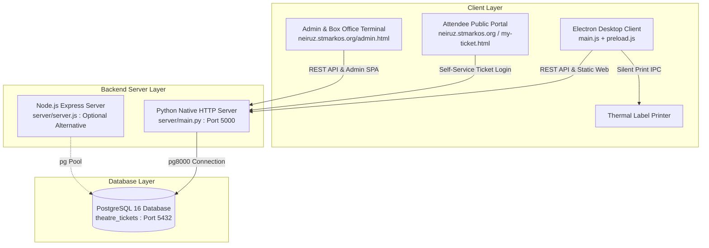
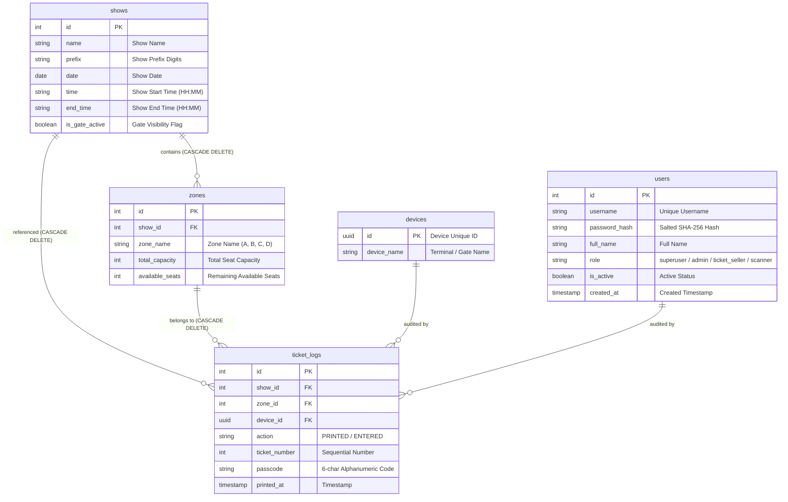

# Theater Ticketing, Silent Printing & Gate Admission System (Neiruz 2026)

A lightweight, high-performance theater seat inventory management, automated silent label printing, and gate admission verification system built for **St. Markos Church (Heliopolis) – Neiruz 2026 Festival (1744 Martyrs)**.

Designed for high-throughput box offices, admission gate barcode scanning, and attendee self-service. It prevents double bookings during concurrent printing via row-level database locking, eliminates print dialogues via an Electron wrapper, validates ticket validity at admission gates with audio-visual feedback, and provides attendees with a digital ticket self-service portal.

---

## 🌟 Key Features

- **Concurrent Row-Level Locking:** Prevents double-booking even when multiple ticket booths print the final remaining seat at the exact same millisecond using PostgreSQL `SELECT ... FOR UPDATE` transactions.
- **Zero-Friction Silent Printing:** Bypasses browser print popups and PDF dialogs by sending formatted label templates directly to default thermal label printers (Zebra, Xprinter, etc.) via Electron OS printer integration.
- **12-Hour AM/PM Time Formatting:** All printed labels and digital tickets display clean 12-hour timestamps with Arabic indicators (e.g. `الساعة: 6:30 م`) without redundant end-times.
- **Batch Ticket Printing:** Allows booth operators to print multiple consecutive tickets in a single request with auto-incrementing sequential numbers.
- **Intelligent Gate Admission Scanner & Show-Time Validation:** Hardware barcode scanner integration that verifies ticket validity, cross-references show date/time against the active gate show to prevent wrong-time admissions (without marking the ticket as used), detects duplicate entries, and gives real-time audio-visual feedback (Web Audio API synthesizers).
- **Gate Show Visibility Control (Superuser):** Superusers can toggle which specific shows appear in the gate check-in dropdown for operators, preventing human error during rush hours.
- **Role-Based Access Control (4 Tier RBAC):**
  - **Level 3 - Superuser (`superuser`):** Full system control, show CRUD, seat capacity overrides, user management, audit logs truncation, and gate visibility manager.
  - **Level 2 - Admin (`admin`):** Dashboard monitoring, ticket printing, gate admission, and audit log inspection.
  - **Level 1 - Ticket Seller (`ticket_seller`):** Ticket printing counter and gate admission.
  - **Level 0 - Gate Scanner (`scanner`):** Dedicated entrance scanner terminal only; immediately redirects to gate tab with all other tabs hidden.
- **Secure Tab-Isolated Sessions:** Admin sessions use `sessionStorage`, automatically terminating when the tab or browser is closed to protect kiosk and shared terminal security.
- **Attendee Self-Service Portal (`neiruz.stmarkos.org` / `my-ticket.html`):** Attendees can log in using their ticket number and random 6-character security passcode to view and download high-resolution PNG copies of their ticket generated via `html2canvas`.
- **Domain-Optimized Routing:** The root URL (`/` or `neiruz.stmarkos.org`) routes directly to the public attendee portal, while administrative functions are accessed via `admin.html`.
- **Real-Time Monitoring Dashboard:** Live overview of occupancy rates, total capacity, remaining seats per zone, chronological show ordering, and quick seat refilling tools.
- **100% Offline Resilience:** Embedded Base64 graphical assets (church logos, theater logos, zone seat maps, and Neiruz QR code) ensure printing and rendering work without external internet access.
- **RTL & BiDi Text Engine:** Fully styled Arabic interface with strict `unicode-bidi: isolate` handling on alphanumeric/numeric fields to eliminate cursor jumping and reverse-typing issues.

---

## 🏗️ Architecture & Technology Stack



| Component | Technology | Description |
| :--- | :--- | :--- |
| **Backend API & Web Server** | Python 3 (`server/main.py`) | Pure Python native server with zero heavy framework overhead, utilizing `pg8000` for transactional database interactions. *(Optional Node.js Express alternative available in `server/server.js`)*. |
| **Database** | PostgreSQL 16 (`postgres:16-alpine`) | Relational database handling strict ACID transactions, foreign key cascades, and row-level locking. |
| **Desktop Client** | Electron.js 31 (`main.js`) | Desktop wrapper enabling background silent printing directly to OS printer drivers (`webContents.print({ silent: true })`). |
| **Frontend UI (Admin)** | HTML5 / Tailwind CSS / Vanilla JS (`admin.html`) | Responsive single-page application for dashboard monitoring, ticket printing, gate verification, and user management. |
| **Attendee Portal** | HTML5 / Tailwind CSS / Canvas (`my-ticket.html`) | Public portal with client-side barcode rendering and `html2canvas` high-DPI PNG generation. |
| **Containerization** | Docker & Docker Compose | Production-ready multi-container configuration with non-root security, health checks, and hot-reload volume mounts. |

---

## 🗄️ Database Schema & Data Models

Database creation script: [`db/schema.sql`](db/schema.sql)



### Initial Show Seeding
- The database comes pre-seeded with **31 shows** imported from [`Copy of Neiruz Tickets 2026.xlsm`](Copy of Neiruz Tickets 2026.xlsm) via [`db/seed.py`](db/seed.py).
- Each show contains **4 distinct seating zones**:
  - **Zone A:** Capacity 125 seats
  - **Zone B:** Capacity 20 seats
  - **Zone C:** Capacity 110 seats
  - **Zone D:** Capacity 155 seats
  - *(Total: 410 seats per show)*

---

## 🎫 Ticket Numbering & Security Format

Each issued ticket is assigned a formatted identifier and an unambiguous security passcode:

1. **Ticket Identifier:** `[Zone] - [Prefix][ZoneDigit][TicketNum:03d]`
   - Example: `A - 111005`
   - `A`: Zone Letter
   - `11`: Show Prefix Code
   - `1`: Zone Digit (`A`=1, `B`=2, `C`=3, `D`=4)
   - `005`: 3-digit zero-padded sequential ticket sequence
2. **Security Passcode:** A 6-character uppercase code (e.g., `X7K2M9`) generated using unambiguous characters (`23456789ABCDEFGHJKLMNPQRSTUVWXYZ`) to avoid confusion between similar characters (e.g., `0`/`O`, `1`/`I`).

---

## 🌐 Public vs. Administrative Routing

When hosting the application (e.g., at `neiruz.stmarkos.org`):

| URL / Path | Target Page | Intended Audience |
| :--- | :--- | :--- |
| **`neiruz.stmarkos.org/`** | `my-ticket.html` | **Festival Attendees** (login via ticket number + passcode to download digital ticket) |
| **`neiruz.stmarkos.org/admin.html`** | `admin.html` | **Box Office, Gate Scanners & Admins** (requires username & password login) |

---

## 🚀 Deployment & Setup Guide

### Method 1: One-Click Docker Hosting (Recommended)

The project includes an optimized, production-hardened Docker configuration.

1. Double-click [`start_docker.bat`](start_docker.bat) or run in terminal:
   ```cmd
   docker compose up --build -d
   ```
2. Docker will automatically launch PostgreSQL 16 (`postgres:16-alpine`), initialize the schema, apply seed data, build the Python backend container running under an unprivileged `appuser`, and serve the application on **`http://localhost:5000`**.
3. To stop the containers, run [`stop_docker.bat`](stop_docker.bat) or `docker compose down`.

---

### Method 2: Direct Windows Hosting (Native)

#### Prerequisites
1. **Python 3.10+**: Ensure *"Add Python to PATH"* is checked during installation.
2. **PostgreSQL 14+**:
   - Create a database named `theatre_tickets`.
   - Run [`db/schema.sql`](db/schema.sql) to create tables.
   - Run [`db/seed.sql`](db/seed.sql) to import pre-configured shows.

#### Starting the Server
1. Navigate to the `server` directory:
   ```cmd
   cd server
   ```
2. Install dependencies:
   ```cmd
   pip install -r requirements.txt
   ```
3. *(Optional)* Configure database credentials in `server/.env` if different from default:
   ```env
   DB_USER=postgres
   DB_PASSWORD=postgres
   DB_HOST=localhost
   DB_PORT=5432
   DB_DATABASE=theatre_tickets
   PORT=5000
   ```
4. Start the backend:
   ```cmd
   python main.py
   ```
5. Access the web interface at **`http://localhost:5000`** (public portal) or **`http://localhost:5000/admin.html`** (admin dashboard).

---

### Method 3: Cloud Deployment (Vercel + Managed Postgres)

To host the public attendee self-service portal on Vercel:
1. Connect a hosted cloud PostgreSQL database ([Neon](https://neon.tech), [Supabase](https://supabase.com), or [Railway](https://railway.app)).
2. Set the `DATABASE_URL` environment variable on your Vercel project settings.
3. Deploy directly via GitHub integration or the Vercel CLI (`vercel --prod`).

---

## 🖥️ Running the Electron Client (For Ticket Printing Terminals)

Web browsers block background silent printing for security reasons. To enable instant silent printing on ticket issuing terminals:

1. **Install Node.js (LTS version)** on the ticket booth machine.
2. In the project root directory, install dependencies:
   ```cmd
   npm install
   ```
3. Start the Electron application:
   ```cmd
   npm start
   ```
4. Clicking **"طباعة التذكرة فوراً" (Print Ticket)** will immediately route the formatted label template directly to the machine's default thermal label printer with no prompts or delays.

---

## 📡 REST API Reference

| Endpoint | Method | Payload / Params | Description |
| :--- | :---: | :--- | :--- |
| `/api/auth/login` | `POST` | `{ username, password }` | Authenticates system users (`superuser`, `admin`, `ticket_seller`, `scanner`). |
| `/api/shows` | `GET` | — | Returns all shows ordered chronologically by date and start time with zones, seat availability, and `is_gate_active` status. |
| `/api/shows` | `POST` | `{ name, prefix, date, startTime, endTime, is_gate_active, zones: [...] }` | Registers a new show with custom zone capacities. |
| `/api/shows/update` | `POST` | `{ id, name, prefix, date, startTime, endTime, is_gate_active }` | Updates an existing show's schedule or metadata. |
| `/api/shows/delete` | `POST` | `{ id: number }` | Deletes a show and cascades deletion to associated zones and ticket logs. |
| `/api/shows/toggle-gate` | `POST` | `{ showId: number, is_gate_active: boolean }` | Toggles whether a show appears in the gate check-in dropdown for operators. |
| `/api/shows/batch-gate` | `POST` | `{ setAll: boolean }` or `{ activeShowIds: [...] }` | Activates or deactivates all gate shows in bulk. |
| `/api/devices/register` | `POST` | `{ id: UUID, deviceName: string }` | Registers or updates a terminal device name. |
| `/api/tickets/print` | `POST` | `{ showId, zoneName, deviceId, count }` | Executes an atomic row-locked booking transaction and returns ticket details. |
| `/api/tickets/verify` | `POST` | `{ code, activeShowId, deviceId }` | Validates ticket, prevents admission if for wrong show/time without consuming ticket, and records entry if valid. |
| `/api/zones/update` | `POST` | `{ zoneId, capacity, availableSeats }` | Manually updates zone capacity or available seat count. |
| `/api/zones/refill-all` | `POST` | — | Resets all zones across all shows to full capacity (`available_seats = total_capacity`). |
| `/api/user/ticket-login` | `POST` | `{ ticketDigits, passcode }` | Authenticates attendee for digital ticket view & PNG download. |
| `/api/users` | `GET` | — | Returns all registered system operators (Superuser only). |
| `/api/users` | `POST` | `{ username, fullName, password, role }` | Creates a new system user account (`superuser`, `admin`, `ticket_seller`, `scanner`). |
| `/api/users/delete` | `POST` | `{ userId: number }` | Removes a system user account. |
| `/api/users/change-password` | `POST` | `{ userId: number, newPassword: string }` | Updates an operator's password. |
| `/api/logs` | `GET` | — | Returns the latest 200 auditing records for printing and admissions. |
| `/api/logs/clear` | `POST` | — | Truncates the `ticket_logs` table (Superuser only). |
| `/api/gate/stats` | `GET` | — | Returns gate entrance statistics (total printed, total entered, duplicates, wrong shows). |

---

## 📁 Project Structure

```
c:/Projects/theatre/
├── Copy of Neiruz Tickets 2026.xlsm       # Original Excel workbook with show schedules
├── README.md                              # Comprehensive project documentation
├── Theater_Ticketing_System_Requirements.md # Technical specification & requirements document
├── docker-compose.yml                     # Multi-container orchestration (PostgreSQL 16 + API)
├── start_docker.bat / stop_docker.bat     # Windows one-click batch scripts for Docker
│
├── package.json / package-lock.json       # Electron desktop wrapper configuration
├── main.js                                # Electron main process handling silent print IPC
├── preload.js                             # Electron context bridge exposing print APIs
├── offline.html                           # Fallback screen shown while waiting for backend server
│
├── db/
│   ├── schema.sql                         # PostgreSQL schema (tables, constraints, cascades)
│   ├── seed.sql                           # Pre-generated seed SQL data for 31 shows
│   ├── seed.py                            # Python script to convert Excel data to seed.sql
│   └── execute_seed.py                    # Direct DB execution script for schema & seed
│
└── server/
    ├── main.py                            # Core Python native HTTP backend server
    ├── db.py                              # PostgreSQL DB-API 2.0 connection helper
    ├── server.js                          # Optional Node.js Express backend alternative
    ├── db.js                              # Node.js pg-pool connection module
    ├── Dockerfile                         # Production Python backend Docker container recipe
    ├── requirements.txt                   # Python dependencies (pg8000, python-dotenv)
    └── static/                            # Web frontend SPA assets
        ├── admin.html                     # Admin & Box Office SPA (Dashboard, Print, Gate, Setup, Audit, Users)
        ├── my-ticket.html                 # Public attendee self-service digital ticket download (Default Root /)
        ├── zone_images.js                 # Embedded Base64 zone maps & logos for offline mode
        ├── Theater Logo.png               # Neiruz theater logo
        ├── st markos-01.png               # St. Markos Church official logo
        ├── qrcode_neiruz.stmarkos.org.png # QR code graphic printed on thermal labels
        └── zone A.png ... zone D.png      # Seating zone diagrams
```

---

## 📜 License

All rights reserved &copy; 2026 St. Markos Coptic Orthodox Church (Heliopolis) – Neiruz 2026.
